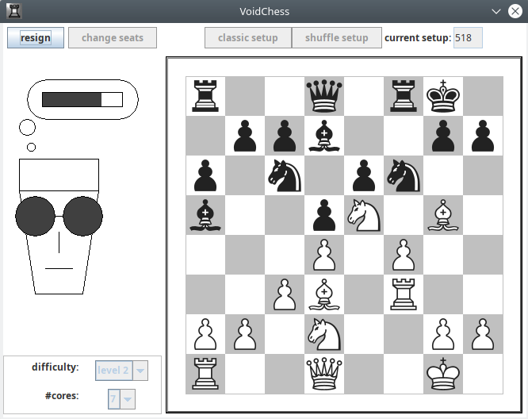

VoidChess
=============

A simple chess program with the option of playing classic chess or Fischer chess (aka chess960) against the computer.



# Download

You can download the installer for Windows, Linux and macOS on [this project's main website](http://simon-void.github.io/voidchess).

# Generating an installer

You can generate an installer by running
```
./gradlew clean packageDistributionForCurrentOs
```
on Linux and MacOS and by running
```
gradlew.bat clean packageDistributionForCurrentOs
```
on Windows.

The installer is generated into the `/build/compose/binaries/main/{os}/` folder. 

**Before you can generate installers you have to install the following programs on your OS:**
- on Red Hat Linux: the *rpm-build* package
- on Ubuntu Linux: the *fakeroot* package
- on macOS: *Xcode command line tools*
- on Windows: *WiX 3.0* or later

## commandline actions

- `./gradlew run` to run the application from source
- `./gradlew packageDistributionForCurrentOs` to store native distribution into build/compose/binaries
